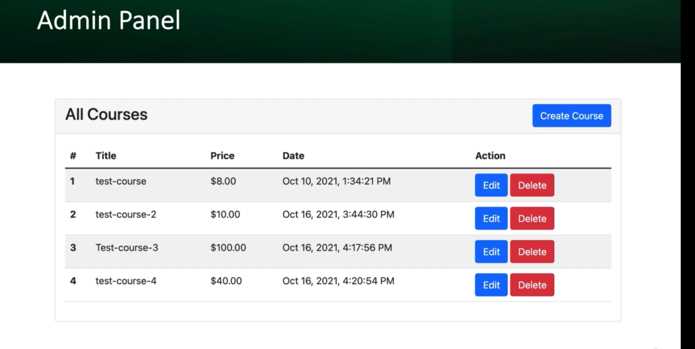

# Course Seller Application

A frontend Application for a Course management [microservice backend service](https://github.com/devgithinji/course-purchase-microservice)

Users can puchase courses and Admin can manage the courses

Developed in React js

